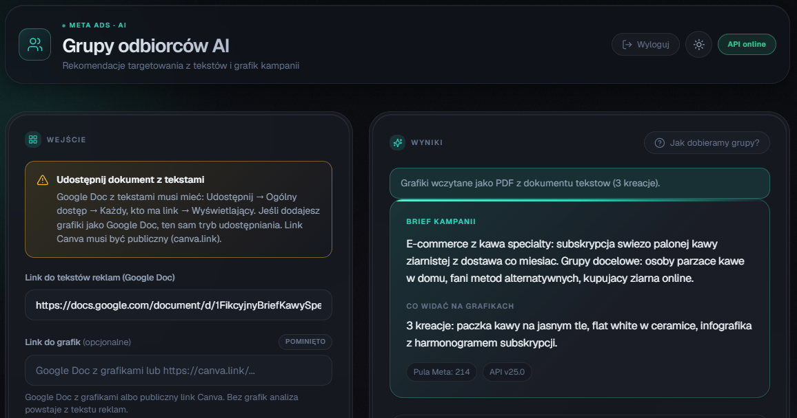
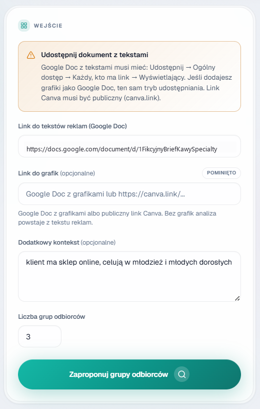
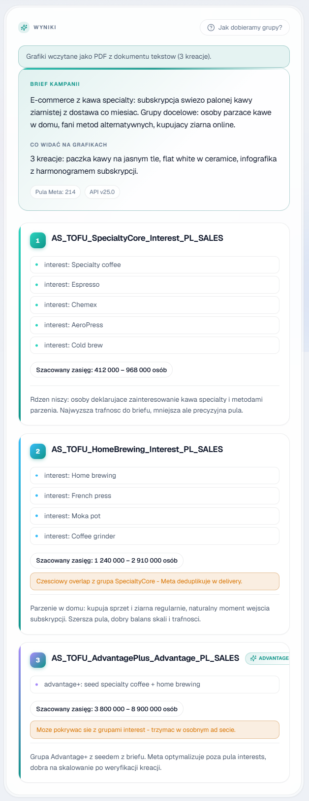
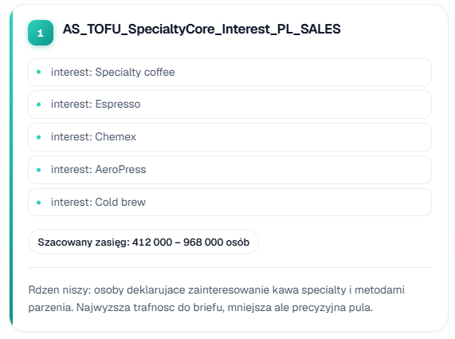
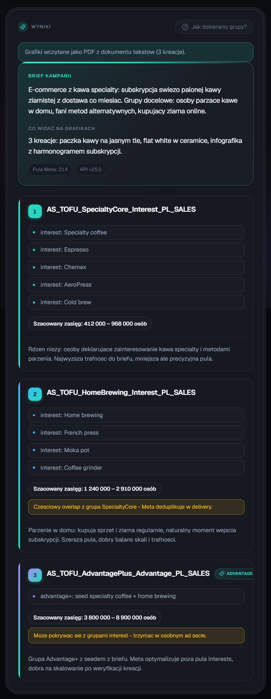
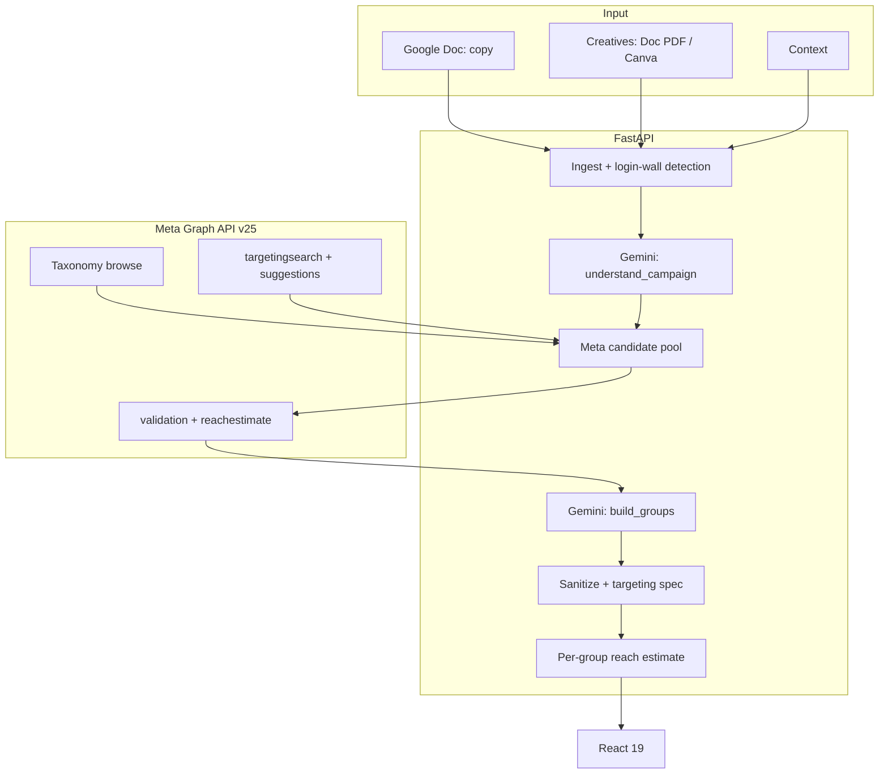

<p align="center"></p>

<h1 align="center">AI Audience Groups</h1>

<h3 align="center">A media buyer pastes a campaign brief link and the system returns ready-made audience groups with reach estimates.</h3>

<p align="center">
  
  
  
  
  
  
</p>

---

## Table of contents

- [About](#about)
- [Screenshots](#screenshots)
- [Source code](#source-code)
- [Stack](#stack)
- [Features](#features)
- [Architecture](#architecture)
- [Statistics](#statistics)
- [Contact](#contact)

---

## About

With every new campaign, a media buyer assembles audience groups by hand in the ad panel. The interest catalog holds thousands of entries. Working by gut ends in generic groups, fillers (birthday months, phone brands) and no scale.

The media buyer pastes a link to a document with ad copy, optionally creatives and context. The system reads the brief, builds a pool of verified candidates from Meta's taxonomy and picks one to ten named groups from it. The model never invents interests: it only uses IDs that Meta confirmed. Each group gets targeting, a reach estimate and a rationale.

In production since June 2026. The agency's media buyers use it for every new campaign. It detects B2B briefs and adds employer and job-title targeting. Ranking comes from the brief alone, and filters cut broad generics and fillers.

---

## Screenshots

| Campaign brief form | Ready groups with reach |
|:---:|:---:|
|  |  |

| Audience group details | Panel in dark mode |
|:---:|:---:|
|  |  |

> **Note:** the screenshots show a fictional campaign (a specialty coffee roastery) against a local API stub. No client data is used.

---

## Source code

The code is private and confidential (an internal agency system). This repo documents the project: description, architecture and screenshots of it in action.

---

## Stack

### Backend (Python 3.11)

```
FastAPI 0.115 + uvicorn       // 3 endpoints, Basic Auth, fail-closed
google-genai                  // Gemini 2.5 Flash, Flash-Lite fallback
Meta Graph API v25            // targetingsearch, suggestions, validation, reachestimate
pypdf                         // image gate for PDFs (min. 200 px)
```

### Frontend

```
React 19 + Vite 6 + TS        // brief form, group cards, dark mode
lucide-react + Geist          // icons and typography
```

### Operations

```
Docker Compose on a VPS       // single API service, /api/health healthcheck
Netlify                       // frontend hosting, deploy via GitHub Actions
pull-deploy.sh                // git pull + compose up on the server
```

---

## Features

### From brief to groups

- **Document import** - paste a link to a Google Doc with copy; the system detects login walls and respects size limits
- **Creatives in the brief** - a separate document or images embedded in the ad copy; Canva goes in as a context note
- **Campaign understanding** - the system extracts a summary, PL/EN keywords, themes and a B2B flag; ignores agency boilerplate and UI screenshots

### Verified Meta options only

- **Four candidate sources** - taxonomy browse, search, Meta suggestions; for B2B also employers and job titles
- **Validation before selection** - only options with at least 1,000 audience and Meta confirmation reach the model
- **Taxonomy cache** - 370 entries in 5 categories, refreshed every 14 days; batching and retry on rate limits

### Group building

- **Structured output** - the model returns groups against a strict schema; fallback to a lighter model on failure
- **Filler filter** - birthday months and infrastructure behaviors (WiFi, phone brands) are dropped unless the brief signals mobile
- **Brief-driven ranking** - zero hardcoded niches; broad generics never beat niche relevance
- **Advantage+** - at least one group carries the advantage audience flag

### Campaign-ready result

- **Targeting spec** - geo PL, age 25-55, flexible_spec OR; JSON ready to paste
- **Reach estimate** - a separate call per group, warning below 300k
- **Naming convention** - AS_[funnel stage]_[angle]_[audience type]_PL_[objective]

### Interface

- **Brief form** - copy link, graphics kind, context, 1-10 group count
- **Group cards** - targeting, reach, rationale, Advantage+ badge, overlap note
- **Algorithm overview** - the 4 group-building steps, light and dark themes, API status
- **Team access** - shared Basic Auth account, noindex, frontend hidden from search engines

---

## Architecture



---

## Statistics

### Technical complexity

| Metric | Value |
|---|---|
| **Commits** | 20 (2026-06 - 2026-07) |
| **Authors** | 1 |
| **Lines of code** | 2924 (1881 Python + 1043 React/TS) |
| **HTTP endpoints** | 3 |
| **Gemini calls per request** | 2 (brief + group building) |
| **Gemini models** | 2 (Flash + Flash-Lite fallback) |
| **Services** | API (Docker on a VPS) + frontend (Netlify) |
| **Taxonomy cache** | 370 entries in 5 categories, 14-day TTL |

### Feature overview

| Category | Highlights |
|---|---|
| **Brief** | document import, creatives, B2B detection |
| **Validation** | verified Meta IDs only, 14-day cache |
| **Building** | filler filter, brief-driven ranking, Advantage+ |
| **Result** | PL targeting, per-group reach, naming |
| **UI** | group cards, dark mode, team access |

---

## Contact

| Platform | Link |
|---|---|
| **WWW** | [kamilkaczmareksolutions.com](https://kamilkaczmareksolutions.com) |
| **GitHub** | [kamilkaczmareksolutions](https://github.com/kamilkaczmareksolutions) |
| **LinkedIn** | [Kamil Kaczmarek](https://www.linkedin.com/in/kamilkaczmareksolutions) |
| **Email** | [recruitment@kamilkaczmareksolutions.com](mailto:recruitment@kamilkaczmareksolutions.com) |

---

**AI Audience Groups** - targeting from the brief, not from memory.

<p align="center"><em>Built by Kamil Kaczmarek</em></p>
