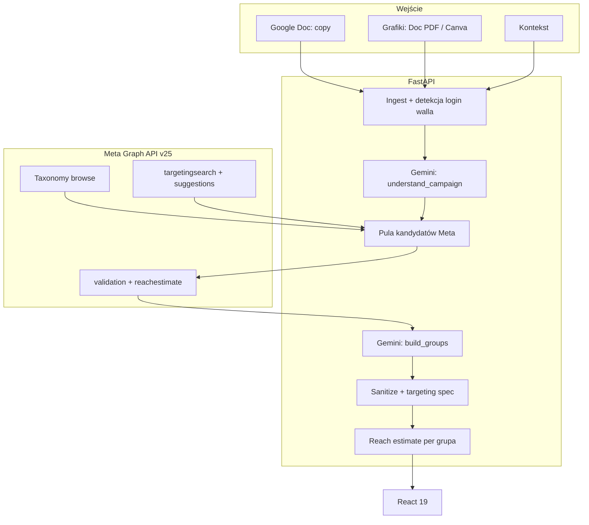

<p align="center"></p>

<h1 align="center">Grupy Odbiorców AI</h1>

<h3 align="center">Media buyer wkleja link do briefu kampanii, a system zwraca gotowe grupy targetowania z szacunkiem zasięgu.</h3>

<p align="center">
  
  
  
  
  
  
</p>

---

## Spis treści

- [O projekcie](#o-projekcie)
- [Screenshoty](#screenshoty)
- [Kod źródłowy](#kod-źródłowy)
- [Stack](#stack)
- [Funkcje](#funkcje)
- [Architektura](#architektura)
- [Statystyki](#statystyki)
- [Kontakt](#kontakt)

---

## O projekcie

Przy każdej nowej kampanii media buyer składa grupy odbiorców ręcznie w panelu reklamowym. Katalog zainteresowań ma tysiące pozycji. Praca na czuja kończy się generycznymi grupami, fillerami (miesiące urodzin, marki telefonów) i brakiem skali.

Media buyer wkleja link do dokumentu z tekstami reklam, opcjonalnie grafiki i kontekst. System czyta brief, buduje pulę zweryfikowanych kandydatów z taksonomii Meta i dobiera z niej od jednej do dziesięciu nazwanych grup. Model nie wymyśla zainteresowań: używa tylko identyfikatorów, które Meta potwierdziła. Każda grupa dostaje targeting, szacunek zasięgu i uzasadnienie.

System działa na produkcji od czerwca 2026. Media buyerzy agencji używają go przy każdej nowej kampanii. Wykrywa briefe B2B i dokłada targetowanie po pracodawcach i stanowiskach. Ranking idzie wyłącznie z briefu, a filtry wycinają wielkie generyki i fillery.

---

## Screenshoty

| Formularz briefu kampanii | Gotowe grupy z zasięgiem |
|:---:|:---:|
|  |  |

| Szczegóły grupy odbiorców | Panel w trybie ciemnym |
|:---:|:---:|
|  |  |

> **Nota:** screenshoty pokazują fikcyjną kampanię (palarnia kawy specialty) na lokalnym stubie API. Żadne dane klientów nie są użyte.

---

## Kod źródłowy

Kod jest prywatny i poufny (system wewnętrzny agencji). To repo dokumentuje projekt: opis, architekturę i zrzuty działania.

---

## Stack

### Backend (Python 3.11)

```
FastAPI 0.115 + uvicorn       // 3 endpointy, Basic Auth, fail-closed
google-genai                  // Gemini 2.5 Flash, fallback Flash-Lite
Meta Graph API v25            // targetingsearch, suggestions, validation, reachestimate
pypdf                         // bramka obrazów w PDF (min. 200 px)
```

### Frontend

```
React 19 + Vite 6 + TS        // formularz briefu, karty grup, dark mode
lucide-react + Geist          // ikony i typografia
```

### Operacje

```
Docker Compose na VPS         // jeden serwis API, healthcheck /api/health
Netlify                       // hosting frontu, deploy z GitHub Actions
pull-deploy.sh                // git pull + compose up na serwerze
```

---

## Funkcje

### Od briefu do grup

- **Import dokumentu** - wklej link do Google Doc z tekstami; system wykrywa login wall i respektuje limity rozmiaru
- **Grafiki w briefie** - osobny dokument albo obrazy w tekstach reklam; Canva trafia jako notatka kontekstowa
- **Zrozumienie kampanii** - system wyciąga podsumowanie, słowa kluczowe PL/EN, tematy i flagę B2B; ignoruje formułki agencji i zrzuty UI

### Tylko zweryfikowane opcje Meta

- **Cztery źródła kandydatów** - przegląd taksonomii, wyszukiwanie, sugestie Meta; przy B2B także pracodawcy i stanowiska
- **Walidacja przed doborem** - tylko opcje z min. 1000 zasięgiem i potwierdzeniem przez Meta trafiają do modelu
- **Cache taksonomii** - 370 pozycji w 5 kategoriach, odświeżane co 14 dni; batch i retry przy rate-limit

### Dobór grup

- **Strukturyzowany wynik** - model zwraca grupy według sztywnego schematu; fallback na lżejszy model przy awarii
- **Filtrowanie fillerów** - miesiące urodzin i zachowania infrastrukturalne (WiFi, marki telefonów) wylatują, chyba że brief sygnalizuje mobile
- **Ranking z briefu** - zero hardkodowanych nisz; wielkie generyki nie wygrywają z trafnością do niszy
- **Advantage+** - co najmniej jedna grupa z flagą advantage audience

### Wynik gotowy do kampanii

- **Targeting spec** - geo PL, wiek 25-55, flexible_spec OR; JSON gotowy do wklejenia
- **Szacunek zasięgu** - osobny call per grupa, ostrzeżenie poniżej 300 tys.
- **Konwencja nazw** - AS_[etap lejka]_[kąt]_[typ grupy]_PL_[cel]

### Interfejs

- **Formularz briefu** - link do tekstów, rodzaj grafik, kontekst, liczba grup 1-10
- **Karty grup** - targeting, zasięg, uzasadnienie, badge Advantage+, nota o overlapie
- **Opis algorytmu** - 4 kroki doboru grup, wersje jasna i ciemna, status API
- **Dostęp zespołowy** - jedno konto Basic Auth, noindex, front poza wyszukiwarkami

---

## Architektura



---

## Statystyki

### Złożoność techniczna

| Metryka | Wartość |
|---|---|
| **Commity** | 20 (2026-06 - 2026-07) |
| **Autorzy** | 1 |
| **Linie kodu** | 2924 (1881 Python + 1043 React/TS) |
| **Endpointy HTTP** | 3 |
| **Wywołania Gemini per request** | 2 (brief + dobór grup) |
| **Modele Gemini** | 2 (Flash + fallback Flash-Lite) |
| **Usługi** | API (Docker na VPS) + front (Netlify) |
| **Cache taksonomii** | 370 pozycji w 5 kategoriach, TTL 14 dni |

### Przegląd funkcji

| Kategoria | Najważniejsze |
|---|---|
| **Brief** | import dokumentu, grafiki, detekcja B2B |
| **Walidacja** | tylko potwierdzone ID Meta, cache 14 dni |
| **Dobór** | filtr fillerów, ranking z briefu, Advantage+ |
| **Wynik** | targeting PL, zasięg per grupa, nazewnictwo |
| **UI** | karty grup, dark mode, dostęp zespołu |

---

## Kontakt

| Platforma | Link |
|---|---|
| **WWW** | [kamilkaczmareksolutions.com](https://kamilkaczmareksolutions.com) |
| **GitHub** | [kamilkaczmareksolutions](https://github.com/kamilkaczmareksolutions) |
| **LinkedIn** | [Kamil Kaczmarek](https://www.linkedin.com/in/kamilkaczmareksolutions) |
| **Email** | [recruitment@kamilkaczmareksolutions.com](mailto:recruitment@kamilkaczmareksolutions.com) |

---

**Grupy Odbiorców AI** - targeting z briefu, nie z pamięci.

<p align="center"><em>Zbudował Kamil Kaczmarek</em></p>
